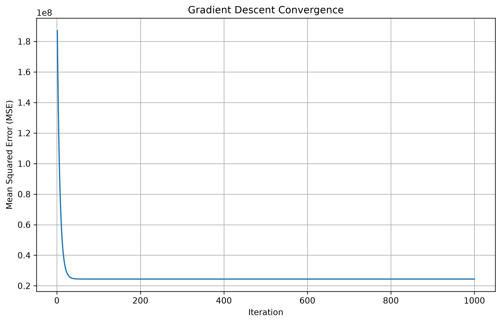

# Gradient Descent Statistical Data Analysis

## Project Overview

This project presents a Python-based statistical data analysis using datasets covering the period from 2010 to 2021.

The project focuses on analyzing demographic and socio-economic data, creating visualizations, and applying a gradient descent-based statistical model to study the relationship between input and output variables.

## Objectives

- Analyze datasets from 2010–2021.
- Perform statistical and numerical analysis using Python.
- Apply the gradient descent optimization technique.
- Study patterns and trends in the available data.
- Create visualizations for better understanding of the datasets.
- Compare the gradient descent result with the closed-form solution.

## Dataset

The project contains Excel datasets for the years 2010–2021.

All datasets are stored in the `Data` folder.

### Dataset Files

- table-6-2_2010.xlsx
- table-6-2_2011.xlsx
- table-6-2_2012.xlsx
- table-6-2_2013.xlsx
- table-6-2_2014.xlsx
- table-6-2_2015.xlsx
- table-6-2_2016.xlsx
- table-6-2_2017.xlsx
- table-6-2_2018.xlsx
- table-6-2_2019.xlsx
- table-6-2_2020.xlsx
- table-6-2_2021.xlsx

## Data Visualization

The project contains graphs representing different aspects of the data:

1. State-wise Data Analysis
2. Population and Growth Rate
3. Economy
4. Unemployment
5. Literacy Rate

All graphs are stored in the `graphs` folder.

### State-wise Data Analysis


### Population and Growth Rate


### Economy


### Unemployment


### Literacy Rate


## Methodology

The project uses gradient descent as an optimization technique.

The model performs the following steps:

1. Calculate predicted values.
2. Calculate the prediction error.
3. Calculate the squared error.
4. Calculate the gradient.
5. Calculate Mean Squared Error (MSE).
6. Update the model weight.
7. Repeat the process for multiple iterations.
8. Compare the final result with the closed-form solution.

The weight is updated using the gradient descent equation:

`w_new = w - learning_rate × gradient`

## Gradient Descent Model

The Python implementation uses an initial weight and a learning rate to iteratively minimize the error between predicted and observed values.

The model uses:

- Initial weight: `10.0`
- Learning rate: `0.001`
- Number of iterations: `1000`

The gradient is calculated from the prediction error and input variable.

## Results

The gradient descent algorithm is applied iteratively to reduce the error between the predicted and observed values.

The final estimated weight is compared with the analytical closed-form solution.

### Result Files

The detailed results are available in the `Results` folder.

- `gradient_descent_results.txt` – Summary of the gradient descent results
- `results.csv` – Iteration-wise results including weight, MSE, and gradient
- `final_result.png` – Gradient descent convergence graph

### Gradient Descent Convergence



### Numerical Results

The model uses the following parameters:

| Parameter | Value |
|---|---:|
| Initial Weight | 10.0 |
| Learning Rate | 0.001 |
| Number of Iterations | 1000 |
| Closed-Form Solution | 2065.4961 |

The final gradient descent value and MSE are provided in the `Results` folder.

## Technologies Used

- Python
- VS Code
- Microsoft Excel
- Git
- GitHub

## Project Structure

```text
Gradient-Descent-Statistical-Model/
│
├── Data/
│   ├── table-6-2_2010.xlsx
│   ├── table-6-2_2011.xlsx
│   ├── table-6-2_2012.xlsx
│   ├── ...
│   └── table-6-2_2021.xlsx
│
├── Gradient-Descent-Statistical-Model.py
│
├── Results/
│   ├── gradient_descent_results.txt
│   ├── results.csv
│   └── final_result.png
│
├── graphs/
│   ├── data_by_state.png
│   ├── population.png
│   ├── economy.png
│   ├── unemployment.png
│   └── literacy_rate.png
│
└── README.md
